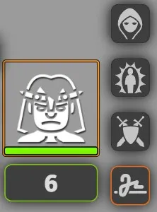
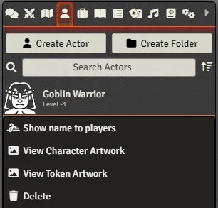
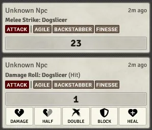
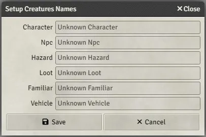

# FoundryVTT Anonymous

This module will attempt to make any "creature" that is not owned by a player anonymous across the foundry. It will also offer the ability to toggle the showing of a creature's name individually.

-   [Combat Tracker](#combat-tracker)
-   [Token Nameplate](#token-nameplate)
-   [Token HUD](#token-hud)
-   [Actors Directory](#actors-directory)
-   [Chat Messages](#chat-messages)
-   [Settings](#settings)
    -   [Setup Names](#setup-names)
    -   [Force Token Nameplate (default)](#force-token-nameplate-default)
    -   [Hide Rolls Details (default)](#hide-rolls-details-default)
    -   [Hide Criticals (default)](#hide-criticals-default)
    -   [Hide Card Content](#hide-card-content)
    -   [Hide Footers](#hide-footers)
-   [Systems and Modules](#systems-and-modules)
    -   [DnD5e](#dnd5e)
        -   [Additional Changes](#additional-changes)
    -   [Pathfinder Second Edition (Official)](#pathfinder-second-edition-official)
        -   [Additional Changes](#additional-changes-1)
        -   [Additional Settings](#additional-settings)
-   [API](#api)
-   [CHANGELOGS](#changelogs)

# Combat Tracker

The name of creatures in the combat tracker will be "hidden" from the players when appropriate.


A new icon is added allowing the GM to toggle the state. If the `Combatant` is not an actual `Actor`, the ability to show its name will still be available, but will be temporary (until the encounter ends).

# Token Nameplate

Any newly created token on the board will see its nameplate "hidden" from the players when appropriate.

-   `Always for Everyone` will become `Always for Owner`
-   `Hovered by Anyone` will become `Hovered by Owner`

If the `Force Token Nameplate` setting is enable, the reverse will also happen for those two options when the GM toggles the state to show the name. The other `displayName` options will never be changed for convenience (e.g. using tooltips instead of nameplates).

# Token HUD



A new icon is added to the token HUD allowing the GM to toggle the state.

# Actors Directory



A new option is added to the actors directory context menu, allowing the GM to toggle the state actor-wide, which means that any token created from that actor will now have that state by default.

# Chat Messages


Every instance of a creature's name (token name, actor name and alias) will be "hidden" from chat messages when appropriate.



Other elements of the chat message can be hidden from the players depending on the settings enabled and the system used:

-   Roll formula and dice details
-   Critical/fumble colorings and texts
-   Footer details

# Settings

## Setup Names



Creatures names can be set by `Actor` type. The types are system dependent.

## Force Token Nameplate (default)

When enabled, this setting will force the display of the token nameplate when the GM decides to show a creature's name, otherwise, nothing will change on the token. The nameplate will always be hidden on the token of a creature with its name hidden regardless of this setting.

The token nameplate will be shown only if the original `displayName` option was one of the two: `Hovered by Owner` or `Always for Owner`.

## Hide Rolls Details (default)

When enabled, roll formula and dice details will be removed from chat messages.

## Hide Criticals (default)

When enabled, critical/fumble coloring will be removed and be shown as any other roll, hidding the fact that a natural 20 or 1 have been rolled. The `Hide Rolls Details` setting must be enabled.

## Hide Card Content

When enabled, the whole body part (usually used for description) of a chat message will be hidden, this doesn't affect the header and roll sections. This is a pretty drastic approach and is disabled by default.

## Hide Footers

When enabled, it will remove the footer of the chat message, this part is usually used to display descriptive tags about the action represented in the message.

# Systems and Modules

Foundry's modularity means an infinite range of informations to hide from the players, this module tries to be agnostic but cannot cover the whole spectrum of systems and modules that could be present in your world.

## DnD5e

### Additional Changes

-   `Hide Criticals` Will hide the critical text from damage messages.

## Pathfinder Second Edition (Official)

The PF2e system has its own feature to hide creature names, this module will disable the metagame setting `Tokens Determine NPC name visibility` to avoid conflicts.

### Additional Changes

-   Hide the target's name in roll messages.

-   `Hide Rolls Details` Will also hide the modifiers tag from roll and damage messages.

-   `Hide Criticals` Will also hide the critical text from damage messages.

### Additional Settings

-   `Hide Traits` Will offer the possibility to hide action traits from chat messages, if `Rolls Only` is selected, the `Hide Rolls Details` setting must be enabled

# API

A set of functions is exposed from the module to be used by third parties:

```js
/**
 * Retrieves the API object containing the funtions
 */
game.modules.get('anonymous').api
```

```js
/**
 * @param {Actor | Combatant} doc
 * @returns {boolean} the current state of visibility
 */
function playersSeeName(doc: Actor | Combatant): boolean
```

```js
/**
 * Toggles the state of visibility
 * This will trigger a refresh of different parts of the UI to reflect the new state
 *
 * @param {Actor | Combatant} doc
 * @returns {Promise<boolean>} a promise with the new state of visibility
 */
function toggleSeeName(doc: Actor | Combatant): Promise<boolean>
```

```js
/**
 * @param {Actor | Combatant} doc
 * @returns {string} the replacement name with no regard for the current state of visibility
 */
function getName(doc: Actor | Combatant): string
```

# CHANGELOGS

You can see the changelogs [HERE](./CHANGELOG.md)
